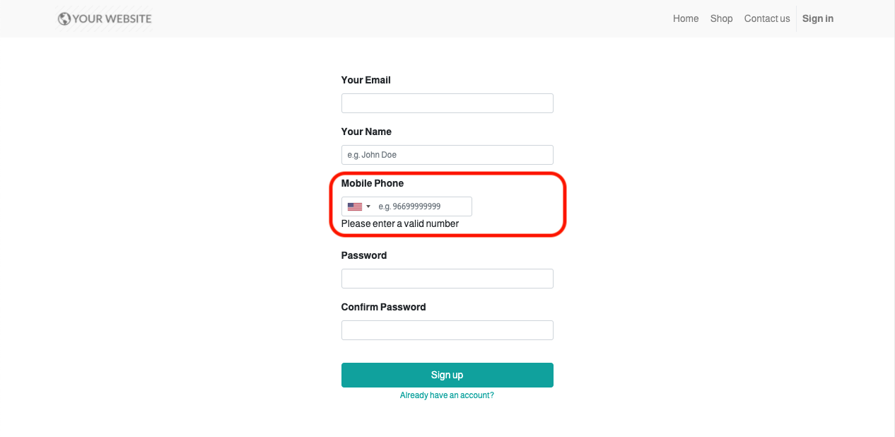

===========================================
International Masked Telephone Input Widget
===========================================

.. |badge1| image:: https://img.shields.io/badge/licence-LGPL--3-blue.png
    :target: http://www.gnu.org/licenses/lgpl-3.0-standalone.html
    :alt: License: LGPL-3

.. |badge2| image:: https://img.shields.io/badge/github-bkerdzaia%2Fodoo_phone_intl-yellowgreen.png?logo=github
    :target: https://github.com/bkerdzaia/odoo_phone_intl/
    :alt: text

|badge1| |badge2|

This module adds possibilities to change phone input mask based on country in odoo form view and in odoo website builder.
It supports different types of phone numbers and automatically validates phone on save.

This module is based on the `International Telephone Input <https://intl-tel-input.com/>`_ and `jQuery Mask Plugin <https://igorescobar.github.io/jQuery-Mask-Plugin/>`_ javascript libraries.

Ps: If you use the website builder (frontend) you need an intenet connecton and use the 'phone' input name to get the complete phone number in your form.

.. image:: static/description/banner.png
   :alt: form view

Usage
=====

Widget options.
~~~~~~~~~~~~~~~

.. list-table::
   :widths: 20 10 10 50
   :header-rows: 1

   * - Option
     - Type
     - Default
     - Description
   * - **allow_dropdown**
     - boolean
     - true
     - Whether or not allow country dial code selection dropdown.
   * - **exclude_country_codes**
     - array
     - []
     - List of country codes to exclude in dropdown.
   * - **only_country_codes**
     - array
     - []
     - Display only these country codes in dropdown.
   * - **preferred_country_codes**
     - array
     - []
     - Preferable country codes that appear top in dropdown.
   * - **phone_number_type**
     - string
     - "MOBILE"
     - One of the following `phone number types <https://github.com/google/libphonenumber/blob/master/javascript/i18n/phonenumbers/phonenumberutil.js#L913>`_
   * - **phone_number_format_type**
     - string
     - "E164"
     - One of the following `phone number formatting types <https://github.com/google/libphonenumber/blob/master/javascript/i18n/phonenumbers/phonenumberutil.js#L900>`_
   * - **separate_dial_code**
     - boolean
     - true
     - Whether or not display dial code next to selected flag in dropdown.
   * - **initial_country_code**
     - string
     - undefined
     - Initialize country selection by specifying its country code.
   * - **sync_country**
     - boolean
     - true
     - Whether or not synchronize dropdown with country field change.
   * - **country_field**
     - string
     - "country_id"
     - Many2one res.country field name to synchronize with. Works when **sync_country** is true.

Example:
~~~~~~~~

.. code-block:: xml

    ...
    <field name="phone" widget="phone_intl" options="{'only_country_codes': ['us', 'gb', 'ca', 'au'], 'country_field': 'country_id', 'separate_dial_code': True, 'initial_country_code': 'us'}"/>
    ...

Frontend (E-Commerce Address SignUp Page Example)
.. code-block:: html

    ...
    

        <label class="col-form-label" for="phone">Phone</label> 
        <input type="tel" name="phone1" t-attf-class="form-control #{error.get('phone') and 'is-invalid' or ''} intl_tel_widget" t-att-value="'phone' in checkout and checkout['phone']"/>
         Please enter a valid number
        <input type="hidden" class="phone_value" name="phone" t-att-value="'phone' in checkout and checkout['phone']"/>
    

    ...

Frontend (Odoo SignUp Page Example)
.. code-block:: html

    ...
    

        <label for="phone">Mobile Phone</label> 
        <input type="tel" name="phone1" t-att-value="phone" id="phone" class="form-control form-control-sm intl_tel_widget" placeholder="e.g. 96699999999"
            required="required" t-att-readonly="'readonly' if only_passwords else None"
            t-att-autofocus="'autofocus' if login and not only_passwords else None"/>
        
Please enter a valid number

        <input type="hidden" class="phone_value" name="phone" value=""/> 
    

    ...

.. image:: static/description/example.gif
   :alt: example

